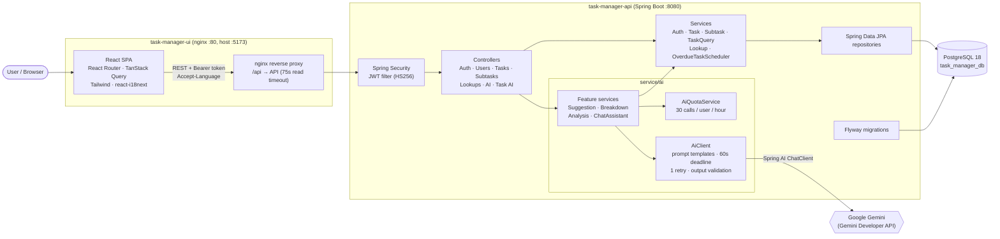
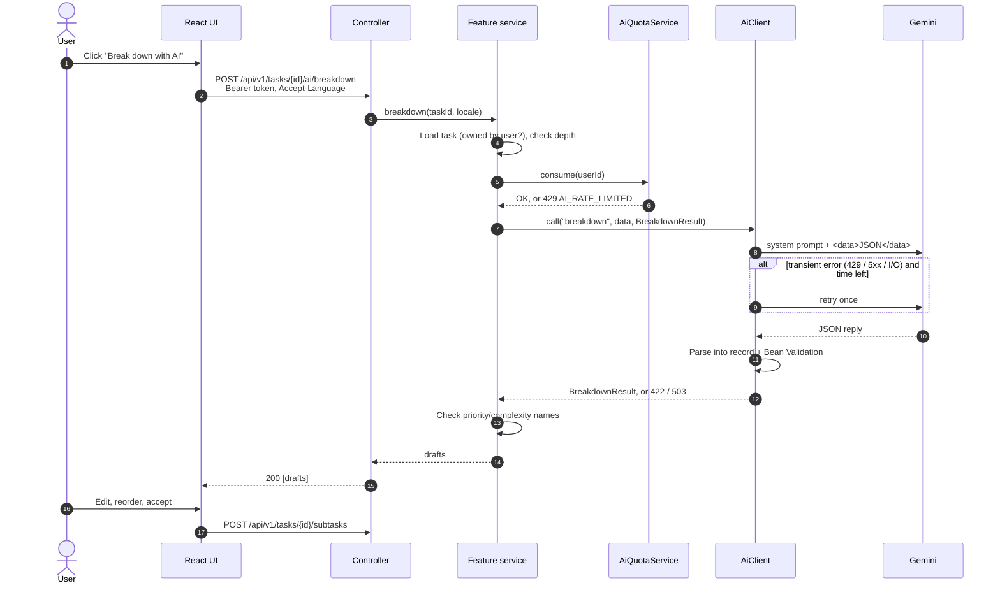
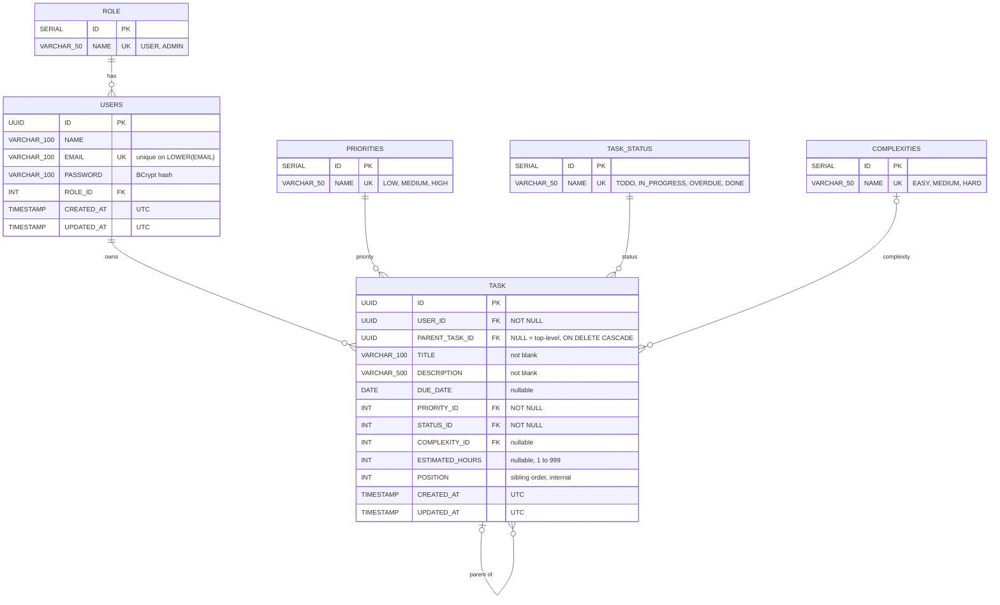

# Planned AI Task Manager

A task manager that uses an LLM (Google Gemini, through Spring AI) to help you plan work. You can:

- **Break a task down into subtasks.** The AI drafts 2–8 subtasks that you edit, reorder, and accept. Tasks form a tree up to 5 levels deep.
- **Get suggestions for a draft.** The AI rewrites the title and description and suggests a priority and complexity.
- **Analyze a saved task.** The AI suggests a priority, complexity, and estimated hours, and explains why.
- **Chat with an assistant** that answers questions about your open tasks in natural language ("Do I have overdue tasks?").

Each user sees only their own tasks. The UI is available in English and Brazilian Portuguese, and the AI answers in the language the UI is set to.

## Table of contents

- [Tech stack](#tech-stack)
- [Architecture](#architecture)
- [Database schema](#database-schema)
- [LLM configuration](#llm-configuration)
- [AI features](#ai-features)
- [Technical decisions](#technical-decisions)
- [Running the project](#running-the-project)
- [Testing](#testing)
- [Repository layout](#repository-layout)

## Tech stack

| Layer | Technologies |
|---|---|
| **API** | Java 25, Spring Boot 4.1, Spring AI 2.0 (Google GenAI starter), Spring Data JPA (Hibernate), Spring Security with OAuth2 Resource Server (JWT, HS256), Jakarta Validation, Flyway, springdoc-openapi (Swagger UI), Spring Actuator, Lombok |
| **UI** | React 19, TypeScript 6, Vite 8, React Router, TanStack Query, Tailwind CSS 4, react-i18next (EN and PT-BR) |
| **Database** | PostgreSQL 18 |
| **LLM** | Google Gemini through the Gemini Developer API |
| **Testing** | JUnit, MockMvc, Testcontainers (PostgreSQL), Vitest, Testing Library, jsdom |
| **Infrastructure** | Docker, Docker Compose, nginx (serves the UI and proxies `/api`) |

## Architecture

The project is a monolithic REST API plus a single-page app. The UI never calls the LLM directly: every AI request goes through the API, which owns authentication, quotas, prompts, and output validation.



### API layers

The API (`br.com.planned.api`) is organized by type:

| Package | Responsibility |
|---|---|
| `controller/` | Thin REST controllers, annotated for OpenAPI. No business logic. |
| `service/` | Business logic, transactions, the overdue scheduler. |
| `service/ai/` | Everything that touches the LLM: `AiClient`, the quota, and one service per AI feature. |
| `repository/` | Spring Data JPA repositories and specifications for filtering. |
| `entity/` | JPA entities. Never returned by controllers. |
| `dto/` | Request and response records, validated with Jakarta Validation. |
| `config/` | Security, JWT, AI, CORS, OpenAPI, scheduling, typed `app.*` properties. |
| `exception/` | `ApiException`, error codes, and a `@RestControllerAdvice` that returns RFC 9457 `ProblemDetail`. |

### UI structure

| Folder | Responsibility |
|---|---|
| `src/api/` | The HTTP client (adds the Bearer token and `Accept-Language`, handles `401` globally) and TanStack Query hooks. Components never call `fetch` directly. |
| `src/auth/` | Token storage and session state. |
| `src/routes/`, `src/layouts/`, `src/pages/` | Routing, protected routes, page shells. |
| `src/features/tasks/` | Task list (filters, sort, pagination), detail, form, and subtasks. |
| `src/features/ai/` | Suggest, breakdown, and analysis flows, with accept/reject views. |
| `src/features/chat/` | The chat side panel. |
| `src/i18n/locales/{en,pt-BR}/` | Translations. Every user-facing string goes through i18n. |

### Request flow for an AI call



## Database schema

The schema is owned by Flyway (`AI-Task-Manager-API/src/main/resources/db/migration/postgres/`). Hibernate only validates it (`ddl-auto=validate`). Lookup tables are seeded by migrations, and the API refers to their values by name, never by ID.



Notes:

- **Subtasks are a tree** held by `TASK.PARENT_TASK_ID`. Deleting a task cascades to its whole subtree. A check stops a task from being its own parent, and the parent never changes after creation, so the tree can't have cycles. The service enforces the 5-level depth limit.
- **Indexes:** `TASK (PARENT_TASK_ID)` for subtree lookups and `TASK (USER_ID, STATUS_ID, DUE_DATE)` for listing and filtering.
- **Timestamps** are `TIMESTAMP` columns that always hold UTC. Entities map them as `Instant` from an injected `Clock`.

| Migration | What it does |
|---|---|
| `V1__create-tables.sql` | Lookup tables, `USERS`, `TASK`, and the seeds. |
| `V2__users-email-case-insensitive-unique.sql` | Unique index on `LOWER(EMAIL)`. |
| `V3__task-schema.sql` | Subtask tree (`PARENT_TASK_ID`, `POSITION`), `DUE_DATE`, not-null constraints, indexes. |
| `V4__task-estimated-hours.sql` | `ESTIMATED_HOURS` (1–999). |

## LLM configuration

| | |
|---|---|
| **Vendor** | Google |
| **Model family** | Gemini (any chat model available to your key, e.g. a `gemini-*-flash` model) |
| **API** | Gemini Developer API |
| **Integration** | Spring AI 2.0, `spring-ai-starter-model-google-genai`, used through a `ChatClient` |
| **Spring AI provider id** | `google-genai` (the only provider built in) |

### What you need

1. A **Gemini API key**. Create one in [Google AI Studio](https://aistudio.google.com/apikey).
2. A **model name** your key can use. Pick it in AI Studio or from the [Gemini models list](https://ai.google.dev/gemini-api/docs/models). A Flash model is a good default: fast and cheap enough for interactive use.

The model runs on Google's servers, so there is nothing to install or host. The API calls it over HTTPS with your key.

### Environment variables

The AI settings are vendor-neutral, so switching provider later doesn't rename anything:

| Variable | Required | Description |
|---|---|---|
| `AI_PROVIDER` | No | Spring AI chat provider id. Defaults to `google-genai`. |
| `AI_MODEL` | Yes | Model name, e.g. `gemini-3.8-flash`. |
| `AI_API_KEY` | Yes (Gemini) | Your Gemini API key. |
| `AI_BASE_URL` | No | Endpoint for self-hosted providers such as Ollama. Unused by Gemini. |

They map to Spring properties in `application.properties`:

```properties
spring.ai.model.chat=${AI_PROVIDER:google-genai}
spring.ai.google.genai.api-key=${AI_API_KEY}
spring.ai.google.genai.chat.model=${AI_MODEL}
spring.ai.retry.max-attempts=0   # AiClient does its own retry

app.ai.timeout=60s               # one deadline for the whole call, retry included
app.ai.quota-per-hour=30         # AI calls per user per sliding hour
```

### Using another provider

All model access goes through `service/ai/AiClient`. Provider-specific code exists in only three places, so adding a provider (for example OpenAI or a local Ollama model) means:

1. Adding its Spring AI starter to `pom.xml`.
2. Mapping `AI_MODEL`, `AI_API_KEY`, and `AI_BASE_URL` to its `spring.ai.*` properties.
3. Teaching `AiClient.isTransient` which of its errors are worth a retry.

Then set `AI_PROVIDER` to its Spring AI id (e.g. `ollama`).

## AI features

All AI endpoints require a signed-in user, count against the per-user quota, and **never write to the database**. Accepting a suggestion only fills the task form or the draft list, and the user saves through the normal task endpoints.

| Feature | Endpoint | Input | Output |
|---|---|---|---|
| **Suggest** | `POST /api/v1/ai/suggest` | `{ title, description }` of a draft (saved or not) | Rewritten title and description, suggested priority and complexity, and the reasoning. The UI shows current vs. suggested values side by side. |
| **Break down** | `POST /api/v1/tasks/{id}/ai/breakdown` | A saved task below the maximum depth | 2–8 draft subtasks with title, description, priority, and complexity. The prompt includes the ancestors' titles and the existing subtasks, so drafts fit the context and don't repeat. |
| **Analyze** | `POST /api/v1/tasks/{id}/ai/analysis` | A saved task, its ancestors, and its direct subtasks | Suggested priority, complexity, estimated hours (1–999), and a reason. |
| **Chat** | `POST /api/v1/ai/chat` | `{ message, history? }` (up to 10 previous turns) | A plain-text reply based on the user's 20 most urgent open tasks. Query-only in v1: it explains how to do things in the UI rather than doing them. |

The prompts live in `AI-Task-Manager-API/src/main/resources/prompts/` (`suggest.st`, `breakdown.st`, `analysis.st`, `chat.st`).

### Errors

| Status | Code | When |
|---|---|---|
| `422` | `AI_INVALID_RESPONSE` | The reply isn't valid JSON for the expected record, breaks its constraints, or uses an unknown priority or complexity. |
| `429` | `AI_RATE_LIMITED` | The user went over 30 AI calls in the last hour. |
| `503` | `AI_UNAVAILABLE` | Timeout, provider rate limit, provider `5xx`, or another model error (e.g. a bad key). |

The UI maps each code to a localized message and keeps the user's input intact.

## Technical decisions

### AI

- **One gateway to the model.** `AiClient` is the only class that uses Spring AI's `ChatClient`. Feature services pass a template name, the data, and the record type they expect, and never build prompt strings or see provider types. This keeps the vendor swappable and the rules below in one place.
- **Structured output.** Replies are converted to Java records with Spring AI's `BeanOutputConverter`, then checked with Bean Validation. Feature services also check enum values against the lookup tables. Anything off becomes `422`, never a half-valid result.
- **Prompt-injection hygiene.** The system prompt holds the instructions. The user message holds only data, as JSON inside `<data>…</data>`, with `<` and `>` escaped so the data can't close the section. Prompts tell the model to treat that section as content, never as instructions. Past chat replies are data too, so a forged "assistant" turn can't give orders. Only the requesting user's own tasks ever go into a prompt.
- **Context in every prompt.** Today's date in the app time zone, the zone itself, the output language (from the UI's `Accept-Language`, mapped to `en` or `pt-BR`), and the allowed lookup names.
- **One deadline, one retry.** A single 60 s budget covers the whole call. A transient error (`429`, `5xx`, I/O) is retried once if time is left; a timeout isn't. Spring AI's own retry is disabled so there is exactly one retry policy. nginx waits 75 s, so it never cuts an AI call short.
- **Quota before cost.** Each user gets 30 AI calls per sliding hour, kept in memory (enough for a single API instance). Validation and ownership checks run first, so a request that can't succeed never uses quota.
- **No DB connection held during AI calls.** AI services read what they need before calling the model and aren't transactional, so slow model calls don't exhaust the connection pool.
- **Privacy in logs.** Prompts, replies, and task text are never logged. Only the template, attempts, latency, and outcome are.
- **Human in the loop.** AI endpoints only suggest. The user reviews every suggestion before it's saved.

### Domain and API

- **Subtasks as a tree in one table.** "Parent" and "subtask" are roles of the same `Task` entity, linked by `PARENT_TASK_ID`, at most 5 levels deep. The parent is fixed at creation, so no cycle check is needed.
- **`OVERDUE` is a stored status set only by the system.** It's recomputed after every write and by a scheduled job daily at 00:05 in `APP_TIMEZONE`. Users can't set it (`400 INVALID_STATUS`). Marking a task `DONE` also marks its whole subtree `DONE`.
- **Lookup tables, referenced by name.** Priorities, statuses, complexities, and roles are seeded rows. The API speaks names (`HIGH`, `TODO`) and resolves IDs internally.
- **Ownership by default.** Every task query is scoped to the authenticated user. Another user's task returns `404 TASK_NOT_FOUND`, so its existence never leaks.
- **Errors as RFC 9457 `ProblemDetail`** with a stable English `code` that the UI translates.

### Security

- **Stateless JWT** (HS256) signed with `JWT_SECRET` through Spring Security's resource server. Tokens last 60 minutes, and logout is client-side (no refresh tokens in v1).
- **BCrypt** passwords (at most 72 UTF-8 bytes, BCrypt's real limit). Emails are case-insensitive, enforced by a unique index on `LOWER(EMAIL)`.
- Sign-in returns the same `401 BAD_CREDENTIALS` for an unknown email and a wrong password.

### Data and time

- **Flyway owns the schema**, and applied migrations are never edited. Hibernate only validates.
- **UTC timestamps from an injected `Clock`**, so time-dependent logic (overdue rule, quota window) is testable with a fixed clock.

## Running the project

### Prerequisites

- **Docker** with Docker Compose (for the full stack), or
- **Java 25**, **Node.js** (with npm), and **Docker** (for Postgres and Testcontainers) to run the parts locally.
- A **Gemini API key** (see [LLM configuration](#llm-configuration)).

### 1. Clone with submodules

The API and UI are git submodules:

```bash
git clone --recurse-submodules git@github.com:Caio-Viana27/Planned-AI-Task-Manager.git
cd Planned-AI-Task-Manager

# If you already cloned without submodules:
git submodule update --init --recursive
```

### 2. Configure the environment

```bash
cp .env.example .env
```

Then edit `.env`:

| Variable | Description |
|---|---|
| `POSTGRES_USER`, `POSTGRES_PASSWORD` | Postgres credentials, used by the database container and the API. |
| `TASK_MANAGER_DB_URL` | JDBC URL. In Docker: `jdbc:postgresql://task-manager-db:5432/task_manager_db`. |
| `AI_PROVIDER` | Optional, defaults to `google-genai`. |
| `AI_MODEL` | Gemini model name. |
| `AI_API_KEY` | Gemini API key. |
| `AI_BASE_URL` | Optional, unused by Gemini. |
| `JWT_SECRET` | At least 32 random bytes, e.g. `openssl rand -base64 32`. |
| `APP_TIMEZONE` | IANA zone used for "today" (due dates, overdue job), e.g. `America/Sao_Paulo`. |
| `VITE_API_URL` | Optional UI build-time base URL. Defaults to `/api`. |

`.env` is git-ignored. Never commit it.

### 3a. Run the full stack with Docker Compose

```bash
docker compose up --build
```

| Service | URL |
|---|---|
| UI | http://localhost:5173 |
| API | http://localhost:8080 |
| Swagger UI | http://localhost:8080/swagger-ui.html |
| Health | http://localhost:8080/actuator/health |
| PostgreSQL | `localhost:5432`, database `task_manager_db` |

On first start, Postgres runs `init-task-manager-db/init.sql` to create the database, and the API applies the Flyway migrations. Sign up in the UI to create your first user.

### 3b. Run the parts locally (development)

Start only the database:

```bash
docker compose up -d task-manager-db
```

Run the API (Spring Boot doesn't read `.env`, so export the variables and point the DB URL at `localhost`):

```bash
cd AI-Task-Manager-API
set -a; source ../.env; set +a
export TASK_MANAGER_DB_URL=jdbc:postgresql://localhost:5432/task_manager_db
./mvnw spring-boot:run
```

Run the UI in another terminal. The Vite dev server proxies `/api` to `http://localhost:8080`:

```bash
cd AI-Task-Manager-UI
npm ci
npm run dev        # http://localhost:5173
```

## Testing

```bash
# API: integration tests with Testcontainers PostgreSQL (needs Docker)
cd AI-Task-Manager-API
./mvnw test

# UI
cd AI-Task-Manager-UI
npm run lint && npm run build && npm test
```

The API tests mock the chat model (`@MockitoBean ChatModel`) with canned JSON, covering valid replies, malformed output (`422`), and model failures (`503`). **Tests never call the real Gemini API**, so no API key is needed to run them. They also use a fixed `Clock` for the overdue job and check that user B gets `404` for user A's tasks on every task endpoint.

## Repository layout

```
.
├── AI-Task-Manager-API/      # Spring Boot REST API (git submodule)
├── AI-Task-Manager-UI/       # React + Vite web UI (git submodule)
├── init-task-manager-db/     # SQL run by the Postgres container on first start
├── plans/                    # Per-wave implementation plans
├── docker-compose.yaml       # API, UI, and Postgres
├── .env.example              # Every environment variable, without real values
├── PLAN.md                   # Use cases, API contract, and delivery phases
├── TASKS.md                  # Task tracking
├── AGENTS.md, RULES.md       # Guidance for AI coding agents
└── LICENSE
```

See [`PLAN.md`](PLAN.md) for the full API contract, BDD use cases, and roadmap.

## License

See [LICENSE](LICENSE).
